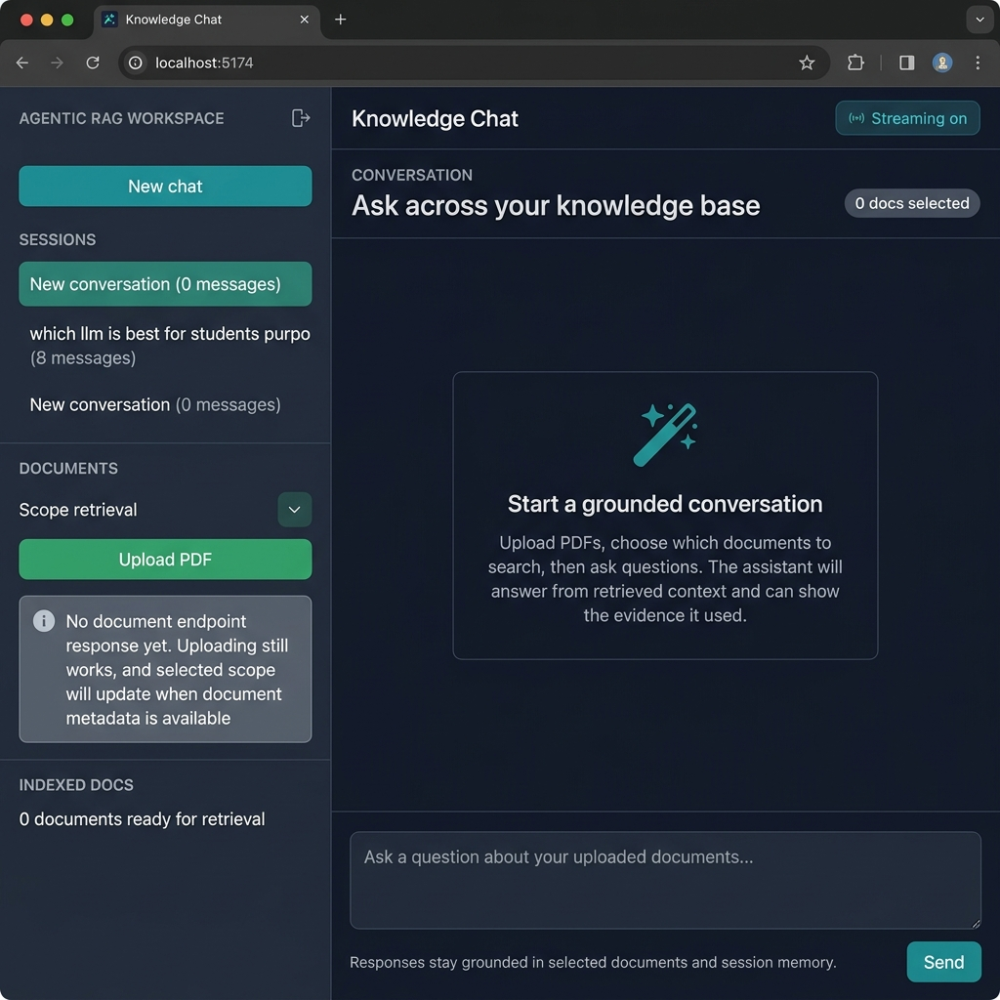
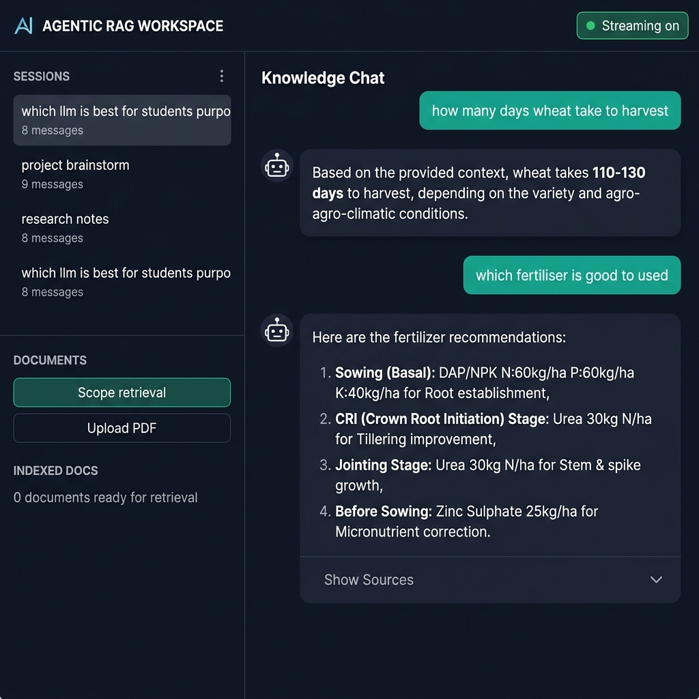

# 🤖 DocAssist AI — Agentic RAG Chat Platform

<div align="center">


**A production-ready, agentic Retrieval-Augmented Generation (RAG) chat platform.**
Upload PDFs → Index them → Ask questions → Get cited, grounded answers.

</div>

---

## 📸 Application Screenshots

### Main Interface — Knowledge Chat Workspace



*Split-panel UI: session sidebar on the left, grounded conversation area on the right. Upload PDFs and select which documents to search before asking questions.*

---

### Live Chat — AI Answering from Indexed Documents



*The AI answers questions grounded strictly in the uploaded PDFs, with sources expandable for each response. Example shows agricultural knowledge retrieval.*

---

## 📋 Table of Contents

- [Overview](#overview)
- [Architecture](#architecture)
- [System Flow](#system-flow)
- [How It Works](#how-it-works)
- [Tech Stack](#tech-stack)
- [Folder Structure](#folder-structure)
- [Setup Instructions](#setup-instructions)
- [How to Run](#how-to-run)
- [API Endpoints](#api-endpoints)
- [Agentic Pipeline](#agentic-pipeline)
- [Frontend Features](#frontend-features)
- [Future Improvements](#future-improvements)

---

## 🎯 Overview

**DocAssist AI** is a full-stack, agentic RAG application that lets users:

1. **Upload** one or more PDF documents
2. **Automatically index** text content using semantic embeddings stored in a local FAISS vector store
3. **Ask natural-language questions** through a ChatGPT-style UI
4. **Receive grounded answers** that cite specific source chunks from the indexed PDFs

The backend uses a modular, graph-based agentic pipeline — classifying queries, retrieving semantically similar chunks with hybrid scoring, building structured context, and calling the Mistral language model to generate cited answers.

---

## 🏗️ Architecture

```
┌─────────────────────────────────────────────────────────────────────────┐
│                          DocAssist AI Architecture                       │
├─────────────────────────────────────────────────────────────────────────┤
│                                                                          │
│   ┌──────────────────────┐        ┌──────────────────────────────────┐  │
│   │    FRONTEND (React)   │        │        BACKEND (FastAPI)          │  │
│   │   Vite + Tailwind CSS │        │         Python 3.10+             │  │
│   │                      │        │                                  │  │
│   │  ┌────────────────┐  │  HTTP  │  ┌────────────────────────────┐  │  │
│   │  │  Chat UI       │◄─┼────────┼─►│   main.py (API Layer)      │  │  │
│   │  │  Session Mgmt  │  │  REST  │  │   /upload /chat /documents │  │  │
│   │  │  PDF Upload    │  │        │  └────────────┬───────────────┘  │  │
│   │  │  Source Viewer │  │        │               │                  │  │
│   │  └────────────────┘  │        │  ┌────────────▼───────────────┐  │  │
│   └──────────────────────┘        │  │   graph.py (AgenticRAG)    │  │  │
│                                   │  │   classify → retrieve →    │  │  │
│                                   │  │   generate_response        │  │  │
│                                   │  └──────┬──────────┬──────────┘  │  │
│                                   │         │          │              │  │
│                                   │  ┌──────▼──┐  ┌───▼──────────┐  │  │
│                                   │  │  rag.py  │  │    llm.py    │  │  │
│                                   │  │ Retrieve │  │ Mistral API  │  │  │
│                                   │  │ Rerank   │  │ Chat Complt. │  │  │
│                                   │  └──────┬──┘  └──────────────┘  │  │
│                                   │         │                         │  │
│                                   │  ┌──────▼──────────────────────┐ │  │
│                                   │  │         vectordb.py          │ │  │
│                                   │  │   FAISS IndexFlatIP          │ │  │
│                                   │  │   + faiss_metadata.json      │ │  │
│                                   │  └─────────────────────────────┘ │  │
│                                   │                                  │  │
│                                   │  ┌────────────────────────────┐  │  │
│                                   │  │       pdf_loader.py        │  │  │
│                                   │  │   pypdf text extraction    │  │  │
│                                   │  │   + sliding window chunks  │  │  │
│                                   │  └────────────────────────────┘  │  │
│                                   │                                  │  │
│                                   │  ┌────────────────────────────┐  │  │
│                                   │  │       embeddings.py        │  │  │
│                                   │  │  sentence-transformers     │  │  │
│                                   │  │  all-MiniLM-L6-v2 (384-d) │  │  │
│                                   │  └────────────────────────────┘  │  │
│                                   │                                  │  │
│                                   │  ┌────────────────────────────┐  │  │
│                                   │  │    SQLite (metadata.db)    │  │  │
│                                   │  │   upload records + paths   │  │  │
│                                   │  └────────────────────────────┘  │  │
│                                   └──────────────────────────────────┘  │
└─────────────────────────────────────────────────────────────────────────┘
```

---

## 🔄 System Flow

### Document Ingestion Flow

```
User Uploads PDF
       │
       ▼
┌─────────────┐
│ POST /upload │
│  (main.py)  │
└──────┬──────┘
       │
       ▼
┌──────────────────┐
│  pdf_loader.py   │
│  pypdf extracts  │
│  text per page   │
└──────┬───────────┘
       │
       ▼
┌──────────────────────┐
│  chunk_pages()       │
│  Sliding window:     │
│  chunk_size + overlap│
│  preserves context   │
└──────┬───────────────┘
       │
       ▼
┌──────────────────────┐
│  embeddings.py       │
│  embed_texts()       │
│  MiniLM-L6-v2        │
│  → 384-dim vectors   │
└──────┬───────────────┘
       │
       ▼
┌──────────────────────┐
│  vectordb.py         │
│  FAISS IndexFlatIP   │
│  add_embeddings()    │
│  + metadata JSON     │
└──────┬───────────────┘
       │
       ▼
┌──────────────────────┐
│  SQLite              │
│  save_upload_record()│
│  filename + path     │
└──────────────────────┘
       │
       ▼
   ✅ Indexed!
```

---

### Query & Answer Flow

```
User Submits Question
       │
       ▼
┌─────────────┐
│  POST /chat  │
│  (main.py)  │
└──────┬──────┘
       │
       ▼
┌──────────────────────────────────────────┐
│           graph.py — AgenticRAGGraph     │
│                                          │
│  Step 1: classify_query()                │
│  ┌────────────────────────────────────┐  │
│  │ Is query a greeting?               │  │
│  │  → "hi/hello/hey" → greeting type  │  │
│  │  → Else            → knowledge_    │  │
│  │                      lookup type   │  │
│  └────────────────────────────────────┘  │
│                                          │
│  Step 2: retrieve_context()              │
│  ┌────────────────────────────────────┐  │
│  │ Only runs for knowledge_lookup     │  │
│  │ → embed_query() via MiniLM-L6-v2   │  │
│  │ → FAISS search (vector similarity) │  │
│  │ → Hybrid reranking:                │  │
│  │    score = 0.75×vector             │  │
│  │          + 0.25×lexical_overlap    │  │
│  │ → Filter by MIN_RELEVANCE_SCORE    │  │
│  │ → Return top_k chunks              │  │
│  └────────────────────────────────────┘  │
│                                          │
│  Step 3: generate_response()             │
│  ┌────────────────────────────────────┐  │
│  │ Greeting?  → canned message        │  │
│  │ No context? → "I do not know..."   │  │
│  │ Has context → build_context()      │  │
│  │              → llm.py Mistral API  │  │
│  │              → cited answer        │  │
│  └────────────────────────────────────┘  │
└──────────────────────────────────────────┘
       │
       ▼
JSON Response:
{
  "answer": "Wheat takes 110-130 days [Source 1]",
  "sources": [
    { "source_file": "...", "page_number": 3, "score": 0.89 }
  ]
}
```

---

## ⚙️ How It Works

### 1. PDF Ingestion Pipeline

When a PDF is uploaded via `POST /upload`:

| Step | Module | Action |
|------|--------|--------|
| Extract | `pdf_loader.py` | Uses `pypdf` to extract raw text per page |
| Chunk | `pdf_loader.py` → `chunk_pages()` | Splits text into overlapping windows for context continuity |
| Embed | `embeddings.py` → `embed_texts()` | Encodes each chunk using `all-MiniLM-L6-v2` (384-dimensional vectors) |
| Index | `vectordb.py` → `add_embeddings()` | Stores vectors in FAISS `IndexFlatIP` (inner-product similarity) |
| Persist | `vectordb.py` → `save()` | Writes FAISS index + JSON metadata to disk |
| Record | `main.py` → SQLite | Saves upload record (filename, path, timestamp) to `metadata.db` |

### 2. Agentic Query Pipeline

When a question is sent via `POST /chat`, the `AgenticRAGGraph` in `graph.py` runs three sequential steps:

#### Step 1 — Query Classification (`classify_query`)
- Checks if the query is a simple greeting (`hi`, `hello`, `hey`)
- Sets `query_type` to either `"greeting"` or `"knowledge_lookup"`
- Avoids unnecessary retrieval for non-knowledge queries

#### Step 2 — Hybrid Retrieval (`retrieve_context`)
- Encodes the query using the same `all-MiniLM-L6-v2` model
- Fetches `fetch_k` candidate chunks from FAISS via inner-product search
- Applies **hybrid reranking**:
  - **Vector score** (75% weight): cosine-like similarity from FAISS
  - **Lexical score** (25% weight): Jaccard-style overlap of tokenized query vs chunk terms
  - **Combined**: `score = 0.75 × vector + 0.25 × lexical`
- Filters out chunks below `MIN_RELEVANCE_SCORE`
- Returns the top-`k` most relevant chunks

#### Step 3 — Answer Generation (`generate_response`)
- If greeting → returns a canned welcome message
- If no context retrieved → returns `"I do not know based on the indexed documents."`
- If context available → calls `llm.py → generate_answer()` which:
  - Builds a structured prompt with the retrieved context + question
  - Sends to Mistral AI (`mistral-small-latest`) at temperature 0
  - Returns a citation-grounded answer referencing `[Source N]` labels

### 3. LLM Prompt Strategy

The system prompt instructs the model to:
- Use **only** the provided context chunks — no hallucinations or outside knowledge
- Cite every factual claim with `[Source N]` references
- Explicitly say `"I do not know"` if the context does not contain the answer
- Explain disagreements if multiple sources conflict

### 4. Vector Store Design

`vectordb.py` implements a `VectorStore` class backed by **FAISS `IndexFlatIP`**:
- **Flat index** — exact search, no approximation error
- **Inner-product** — equivalent to cosine similarity for normalized vectors
- **Incremental updates** — new PDFs add to the existing index
- **Document deletion** — removes vectors by source file and rebuilds the index
- **Persistence** — index + metadata saved to disk after every change

---

## 🛠️ Tech Stack

| Layer | Technology | Purpose |
|-------|-----------|---------|
| **Frontend** | React 18 + Vite | Chat UI, session management, PDF upload |
| **Styling** | Tailwind CSS | Dark mode, responsive layout |
| **Backend** | FastAPI (Python 3.10+) | REST API, middleware, CORS |
| **Embedding Model** | `sentence-transformers/all-MiniLM-L6-v2` | 384-dim semantic embeddings |
| **Vector Database** | FAISS `IndexFlatIP` | Fast inner-product similarity search |
| **LLM** | Mistral AI (`mistral-small-latest`) | Contextual answer generation |
| **PDF Parsing** | `pypdf` | Text extraction from uploaded PDFs |
| **Metadata Storage** | SQLite | Upload records (filename, path, timestamp) |
| **Server** | Uvicorn | ASGI server for FastAPI |
| **Logging** | Python `logging` | Structured app logs |

---

## 📁 Folder Structure

```text
rag-agent-chat/
├── images/                     # App screenshots (README assets)
│   ├── main_ui.png             #   Main workspace UI screenshot
│   └── chat_response.png       #   Chat response with sources screenshot
│
├── backend/                    # Python FastAPI backend
│   ├── main.py                 #   API entry point, routes, CORS, SQLite ops
│   ├── graph.py                #   AgenticRAGGraph: classify → retrieve → respond
│   ├── rag.py                  #   ingest_pdf(), retrieve_context(), build_context()
│   ├── embeddings.py           #   embed_texts() + embed_query() (MiniLM-L6-v2)
│   ├── vectordb.py             #   VectorStore: FAISS IndexFlatIP + metadata JSON
│   ├── pdf_loader.py           #   extract_pages_from_pdf() + chunk_pages()
│   ├── llm.py                  #   Mistral API call + prompt builder
│   ├── config.py               #   Settings (env vars, paths, model config)
│   ├── db/
│   │   └── metadata.db         #   SQLite: upload records
│   └── logs/
│       └── app.log             #   Structured application logs
│
├── data/
│   ├── docs/                   # Uploaded PDF files (stored on disk)
│   └── index/
│       ├── faiss.index         # Persisted FAISS vector index
│       └── faiss_metadata.json # Chunk metadata (source, page, text, score)
│
├── frontend/                   # React + Vite frontend
│   ├── src/
│   │   ├── App.jsx             #   Root app component
│   │   ├── main.jsx            #   React entry point
│   │   ├── index.css           #   Global Tailwind styles
│   │   ├── components/         #   Reusable UI components
│   │   ├── hooks/              #   Custom React hooks
│   │   ├── pages/              #   Page-level components
│   │   └── services/           #   API service layer
│   ├── index.html              #   HTML shell
│   ├── package.json            #   Node dependencies
│   ├── tailwind.config.js      #   Tailwind configuration
│   ├── postcss.config.js       #   PostCSS setup
│   └── vite.config.js          #   Vite dev server config
│
├── requirements.txt            # Python dependencies
├── .env                        # Environment variables (MISTRAL_API_KEY)
└── README.md                   # This file
```

---

## 🚀 Setup Instructions

### Prerequisites

- Python 3.10+
- Node.js 18+ and npm
- A [Mistral AI API key](https://console.mistral.ai/)

### 1. Clone the Repository

```bash
git clone https://github.com/parul67/DocAssist-AI-.git
cd DocAssist-AI-/rag-agent-chat
```

### 2. Backend Setup

```bash
# Create and activate a virtual environment
python -m venv .venv
# Windows:
.venv\Scripts\activate
# macOS/Linux:
source .venv/bin/activate

# Install Python dependencies
pip install -r requirements.txt
```

### 3. Configure Environment Variables

Create or edit `.env` in `rag-agent-chat/`:

```env
MISTRAL_API_KEY=your_mistral_api_key_here
```

### 4. Frontend Setup

```bash
cd frontend
cp .env.example .env
npm install
```

---

## ▶️ How to Run

### Start the Backend

```bash
# From rag-agent-chat/backend/
cd backend
uvicorn main:app --host 0.0.0.0 --port 8000 --reload
```

API available at: **`http://127.0.0.1:8000`**
Swagger docs: **`http://127.0.0.1:8000/docs`**

### Start the Frontend

```bash
# From rag-agent-chat/frontend/
cd frontend
npm run dev
```

Frontend available at: **`http://127.0.0.1:5173`**

---

## 📡 API Endpoints

### `GET /health`
Returns backend health status.
```json
{ "success": true, "message": "Service is healthy." }
```

---

### `POST /upload`
Uploads and indexes a PDF file.

| Field | Type | Description |
|-------|------|-------------|
| `file` | `multipart/form-data` | PDF file to upload |

```bash
curl -X POST "http://127.0.0.1:8000/upload" \
  -F "file=@sample.pdf"
```

**Response:**
```json
{
  "success": true,
  "message": "PDF uploaded and indexed.",
  "data": { "filename": "sample.pdf", "chunks_indexed": 42 }
}
```

---

### `POST /chat`
Answers a question using retrieved PDF context.

**Request body:**
```json
{ "query": "What are the main conclusions of the document?" }
```

**Response:**
```json
{
  "success": true,
  "data": {
    "query": "What are the main conclusions of the document?",
    "answer": "The document concludes that... [Source 1]",
    "sources": [
      {
        "source_label": "Source 1",
        "source_file": "sample.pdf",
        "chunk_id": 7,
        "page_number": 3,
        "score": 0.872,
        "vector_score": 0.91,
        "lexical_score": 0.75
      }
    ]
  }
}
```

---

### `GET /documents`
Returns all uploaded document metadata.

```json
{
  "success": true,
  "data": [
    {
      "id": 1,
      "file_name": "sample.pdf",
      "stored_path": "/data/docs/abc123_sample.pdf",
      "uploaded_at": "2025-08-07T10:00:00+00:00",
      "exists": true
    }
  ]
}
```

---

### `DELETE /documents/{document_id}`
Deletes a document, removes its vectors from the FAISS index, and cleans up the file.

```bash
curl -X DELETE "http://127.0.0.1:8000/documents/1"
```

---

### `GET /chat/stream`
Streams tokens progressively for a ChatGPT-style typing effect.

```bash
curl -N "http://127.0.0.1:8000/chat/stream?question=Summarize%20the%20document&session_id=test-session"
```

---

## 🤖 Agentic Pipeline

The core of DocAssist AI is the `AgenticRAGGraph` in `graph.py`. It orchestrates a three-step agentic pipeline for every query:

```
Query Input
    │
    ▼
[Step 1] classify_query()
    ├── "greeting"         → skip retrieval
    └── "knowledge_lookup" → continue
         │
         ▼
    [Step 2] retrieve_context()
         ├── embed_query() → 384-dim vector
         ├── FAISS search → top candidates
         ├── Hybrid rerank (75% vector + 25% lexical)
         └── Filter by MIN_RELEVANCE_SCORE
              │
              ▼
         [Step 3] generate_response()
              ├── No context → "I do not know..."
              └── Has context → Mistral API → cited answer
                       │
                       ▼
                  Final Answer + Sources
```

**Why hybrid scoring?**
Pure vector search can miss exact keyword matches. Adding a lexical overlap component (25%) helps retrieve chunks that share exact terminology with the query, while the vector component (75%) captures semantic meaning.

---

## 💡 Frontend Features

| Feature | Description |
|---------|-------------|
| **Split-panel Layout** | Sidebar for sessions + main conversation area |
| **Session Management** | Create, switch between, and name chat sessions |
| **PDF Upload** | Drag-and-drop or click-to-upload with progress feedback |
| **Document Scope** | Select which uploaded documents to search |
| **Streaming Responses** | Token-by-token response rendering with stop control |
| **Source Viewer** | Expandable citations showing source file, page, chunk, and relevance score |
| **Copy & Regenerate** | Copy assistant messages or regenerate answers |
| **Dark Mode** | Full dark theme with localStorage persistence |
| **Responsive Design** | Works on desktop and tablet viewports |

---

## 🔮 Future Improvements

- [ ] Per-document chunk filtering using `doc_ids` parameter
- [ ] Token-aware chunking (respect sentence boundaries)
- [ ] Background ingestion jobs using Celery or FastAPI BackgroundTasks
- [ ] User authentication and multi-user support
- [ ] Re-ranking with a cross-encoder model (e.g. `ms-marco-MiniLM`)
- [ ] Full streaming (`/chat/stream`) backend implementation
- [ ] Citation formatting with exact page quotes
- [ ] Support for additional file types (`.docx`, `.txt`, `.md`)
- [ ] Docker Compose deployment configuration

---

## 📄 Logging

Application logs are written to `backend/logs/app.log` and include:

- Incoming API request method + path
- Query classification results
- Number of chunks retrieved + context length
- LLM response preview (first 300 characters)
- Error traces with stack info

---

<div align="center">

**Built with ❤️ using FastAPI · FAISS · Mistral AI · React**

</div>
